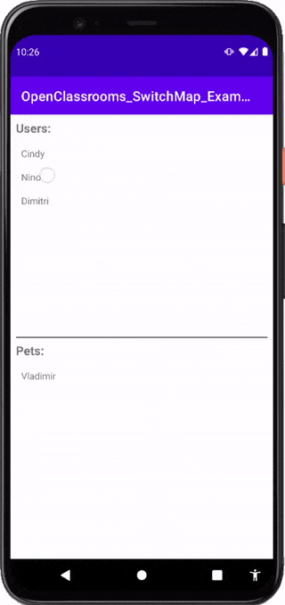

# OpenClassroom - MediatorLiveData - Example
Ce projet permet d'avoir un exemple d'une application **Android** écrite en **Java** avec une architecture **MVVM** simple, utilisant des `LiveData`.

## Démo

## Présentation globale
Une liste d'utilisateur est présentée, et au click sur un de ces utilisateurs, on affiche les noms des animaux de compagnie de cet utilisateur. Cette deuxième partie est codée grâce à un switchMap, à voir ici : https://github.com/NinoDLC/OpenClassrooms_SwitchMap_Example/blob/master/app/src/main/java/fr/delcey/switchmap/ui/MainViewModel.java#L37

## NB
Par soucis de simplicité, le `MainViewModel` ne transforme pas les `UserEntity` et `PetEntity` (via un `Transformations.map()`. C'est une très mauvaise pratique, jamais la vue ne devrait "connaitre" les classes Entity. 
